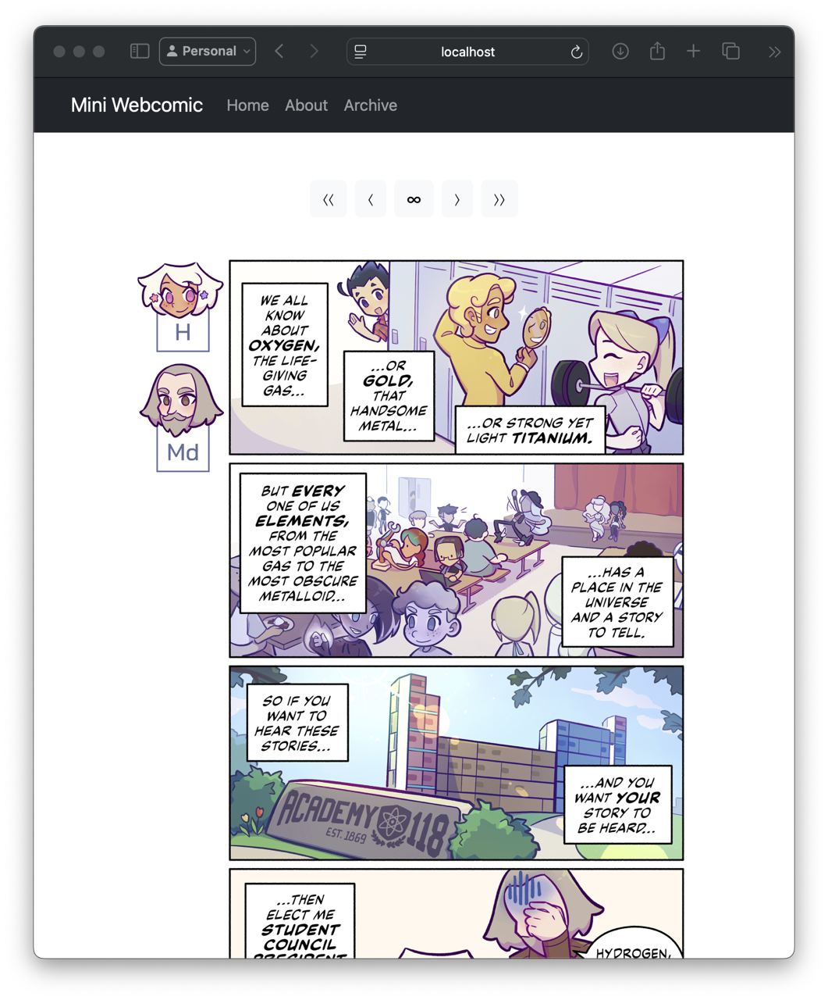

# mini-php-webcomic



**mini-php-webcomic** is a minimal, responsive webcomic template built with PHP and MariaDB.
It was created for my comic, *[Academy 118](https://academy118.com)*.

> Not into PHP? Try **[mini-hugo-webcomic](https://github.com/AvaLovelace1/mini-hugo-webcomic)**!

## Installation

Make sure you have the latest version of [PHP](https://www.php.net/downloads.php) installed. Then, clone this
repository:

```bash
git clone https://github.com/AvaLovelace1/mini-php-webcomic.git
```

Place the repository contents into the root directory of your web server.

### Database setup

**mini-php-webcomic** stores comics in an SQL database. We recommend using [MariaDB](https://mariadb.com) for database
management.

After [installing MariaDB](https://mariadb.com/download/), start
the [MariaDB server](https://mariadb.com/docs/server/server-management/starting-and-stopping-mariadb). Then, enter the
MariaDB shell by running:

```bash
mysql
```

Create a new database for the webcomic by running the following command in the MariaDB shell:

```sql
CREATE DATABASE miniwebcomic;
```

Then, create a new user with your desired username and password, and grant it all privileges on the database:

```sql
CREATE USER 'username'@'localhost' IDENTIFIED BY 'password';
GRANT ALL PRIVILEGES ON miniwebcomic.* TO 'username'@'localhost';
```

Import the initial database schema by running the following command in the command line:

```
mysql -u [username] -p miniwebcomic < miniwebcomic.sql
```

Finally, change the `username` and `password` fields in the file `php/database.php` to your MariaDB username and
password.

## Usage

### Site customization

This template’s layout and styling are intentionally kept bare-bones to allow for easy customization. You can modify
the site to your heart’s content by editing the `.php` and `css/style.css` files.

### Adding new comics

Comics are organized into *episodes*. Each episode contains one or more *comic pages*.

Add new comic pages and episodes by `INSERT`ing rows into the `comics` and `episodes` tables in the
`miniwebcomic` database, respectively. Comics will auto-publish based on the given `publish_date`.

Comic image files should be stored in the `img/comic` directory. Image filenames follow the format
`[filename]_[pageNumber].[extension]`. The
`pageNumber` must be padded with leading zeros to a length of 3.

